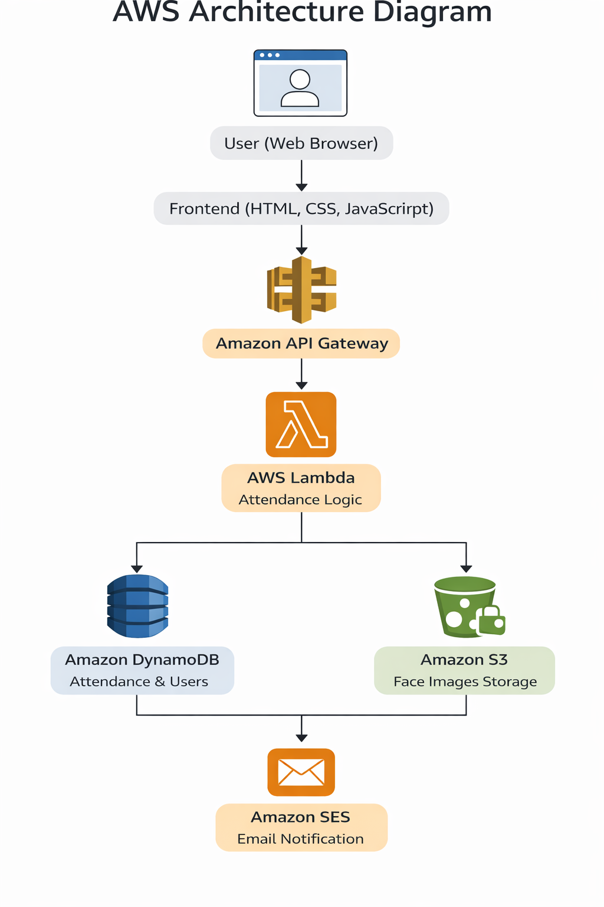

🚀 Smart Attendance System (AWS Serverless)

A cloud-based face recognition attendance system built using AWS Serverless Architecture.
This system automates attendance using face capture, stores records securely, provides role-based dashboards, analytics, report downloads, and sends real-time email notifications.
________________________________________
📌 Project Overview

The Smart Attendance System removes manual attendance and proxy issues by using face-based verification and a serverless cloud backend.
Users register, capture their face, and mark attendance through a modern web interface.
Attendance is recorded securely and can be viewed, analyzed, and exported by authorized roles.
________________________________________
✨ Key Features

👤 User Registration & Login

    •Role-based registration:

            o Admin

            o Staff

            o Student

  •	Secure login
  
  •	Face registration using webcam

📸 Face-Based Attendance

 •	Live camera capture
 
 •	Attendance marked only after face capture
 
 •	Prevents fake/proxy attendance
 
 •	Real-time success confirmation

🧑‍💼 Role-Based Dashboards

 •	Admin Dashboard – Full system access
 
 •	Staff Dashboard – Attendance & reports
 
 •	Student Dashboard – Personal attendance & analytics

📊 Attendance Management
 
 •	Date range filter
 
 •	Role-based filter
 
 •	Search by name / register number
 
 •	Clear PRESENT / ABSENT status

 •	Time-stamped entries

📥 Attendance Download
 
 •	Export reports as:
       o	CSV
       o	Excel (.xlsx)
       o	PDF

 •	Filter by date, role, and status

📈 Attendance Percentage & Analytics
 
 •	Total working days
 
 •	Present / Absent count
 
 •	Attendance percentage

 •	Visual donut chart
 
 •	Performance feedback message

📧 Email Notification (AWS SES)

 •	Automatic email after attendance marking
 
 •	Includes date, time, role, and status

•	Delivered using Amazon SES
________________________________________

🖼️ Application Screenshots

All major features are implemented and demonstrated below:

📝 User Registration – Account & Role Creation

📸 Face Registration – Live Camera Capture

🔐 Login Page – Secure User Authentication

🔐 Admin Dashboard – Profile & System Modules

🧑‍🏫 Staff Dashboard – Attendance & Management Access

🎓 Student Dashboard – Personal Attendance Overview

📸 Mark Attendance – Live Face Capture & Verification

📋 Attendance Records – Date & Role Filtering

👥 User Management – Admin Control Panel

📥 Attendance Download – CSV, Excel & PDF Reports

📈 Attendance Percentage – Analytics & Visual Chart

📧 Email Notification – Attendance Confirmation

________________________________________

☁️ AWS Architecture Diagram

The system follows a fully serverless AWS architecture, ensuring scalability, security, and low operational cost.

Architecture Flow:

1.	User accesses frontend (browser)

2.	Requests sent via API Gateway

3.	AWS Lambda processes logic

4.	Attendance & user data stored in DynamoDB

5.	Face images stored in S3

6.	Email notification sent via SES
________________________________________

🛠️ Technology Stack

Frontend

•	HTML5

•	CSS3 (modern card-based UI)

•	JavaScript

•	Web Camera API

Backend (AWS Serverless)

•	AWS Lambda

•	Amazon API Gateway

•	Amazon DynamoDB

•	Amazon S3

•	Amazon SES (Email Service)
________________________________________

🗂️ Project Structure
smart-attendance-system-aws/

│

├── frontend/

│   ├── register.html

│   ├── register-face.html

│   ├── login.html

│   ├── admin-dashboard.html

│   ├── staff-dashboard.html

│   ├── student-dashboard.html

│   ├── mark-attendance.html

│   ├── attendance-records.html

│   ├── attendance-download.html

│   ├── attendance-percentage.html

│   └── user-management.html

│

├── lambda/

│   ├── registerUser.py

│   ├── markAttendance.py

│   ├── getAttendanceRecords.py

│   ├── sendEmailNotification.py

│   └── utils.py

│

├── screenshots/

│   ├── admin-dashboard.png

│   ├── staff-dashboard.png

│   ├── student-dashboard.png

│   ├── attendance-mark.png

│   └── attendance-percentage.png

│

├── architecture/

│   └── aws-architecture.png

│

├── README.md

├── LICENSE

└── .gitignore

________________________________________

🔄 Application Workflow

1.	User registers and selects role

2.	Face image captured and stored

3.	User logs in

4.	Face captured during attendance marking

5.	Attendance saved in DynamoDB

6.	Email notification sent via AWS SES

7.	Attendance available for analytics and download
________________________________________

🚀 Run Frontend Locally

cd frontend

python -m http.server 5500

Open in browser:

http://127.0.0.1:5500/frontend/login.html
________________________________________

🌟 Future Enhancements

•	AWS Rekognition integration

•	Mobile application

•	Admin approval workflow

•	OTP / MFA login

•	Advanced attendance analytics
________________________________________

👨‍💻 Author

Subash M

📧 mailtomsubash@gmail.com

🔗 GitHub: https://github.com/subashmuruga

Built with ❤️ using AWS Serverless Architecture

